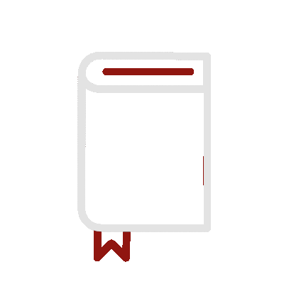
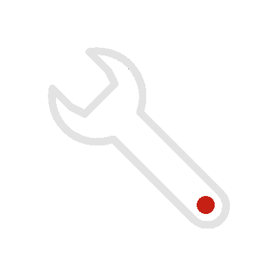
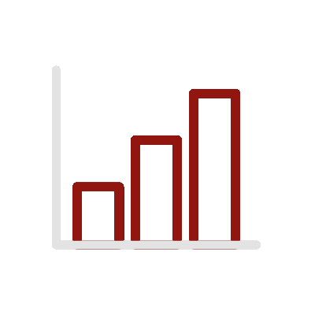

# Hey There!  

I am <strong>Raghid<strong>, the coding ninja who transforms lines of code into magic spells, creating wonders in the digital realm!

-  Currently working on a SE project
-  Ask me about anything tech related

# Tools and Languages 

<h3></h3>

 

  

<h3></h3>

 

 

<h3> - </h3>

 

  
  
 

<h3></h3>

 

 

<h3></h3>

 
 

# Socials 

# Github Achievements 

  

# Stats 

   <table>
      <tr>
       <th>Profile stats  </th>
       <th>Language Contribution</th>
     </tr>
      <tr>
       <td> </td>
       <td> </td>
     </tr>
   </table>

